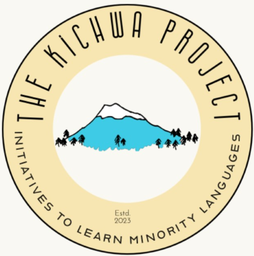

# Kichwata yachakushun
## Aprendamos Kichwa
## Let's learn Kichwa
</center
  

  
Kichwa is a Quechuan language spoken by the indigenous peoples of the Andes, mainly in Ecuador, Peru, Bolivia, and Colombia. This project aims to promote the Kichwa language and culture by offering free resources available on the internet that people can find and learn in a self-taught way. Compiling texts, videos, and other relevant materials favors the student because all the material can be found in one place.
* **[Learning](modules/learning/_posts/2023-04-29-info.md)**
* **[Resources](modules/resources/_posts/2023-04-29-info.md)**
* **[Contact](modules/contact/_posts/2023-04-29-info.md)**
